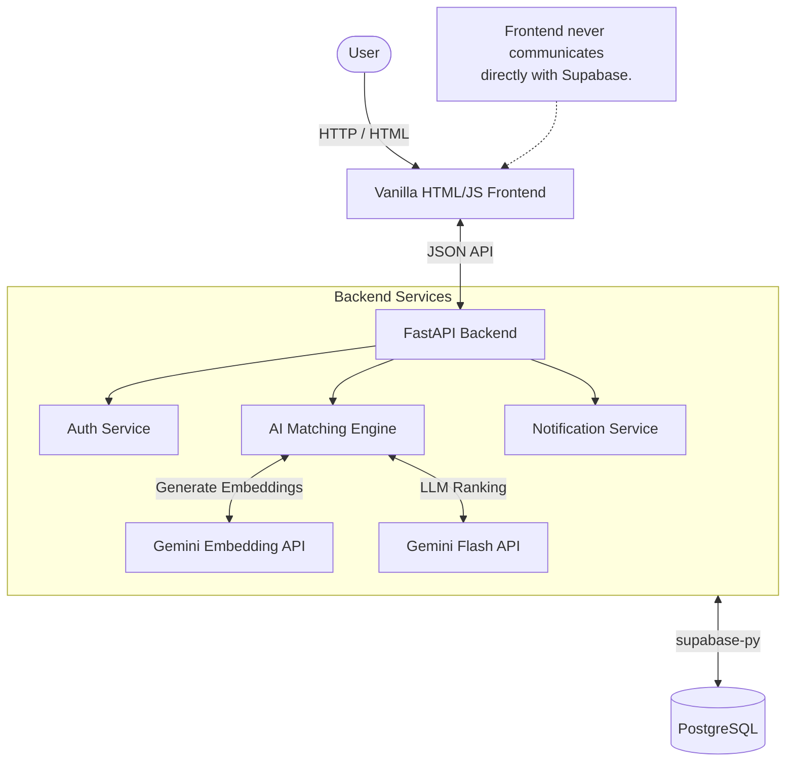
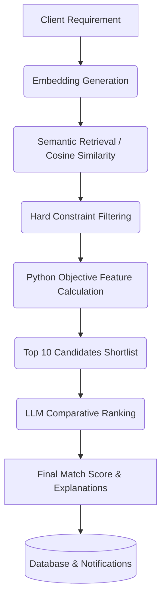

# Hubify - AI-Powered Client–Supplier Procurement Platform

Hubify is a sophisticated web-based B2B procurement platform designed to bridge the gap between buyers and sellers. It moves beyond traditional keyword-based directory searches by leveraging artificial intelligence to deeply understand procurement requirements and automatically evaluate supplier offerings. 

On Hubify, clients can submit detailed product requirements including technical specifications, delivery constraints, and budgets. Suppliers can list their available inventory, unit prices, and capabilities. The platform then acts as an intelligent intermediary, automatically analyzing new listings and instantly notifying relevant parties of high-confidence business opportunities.

At its core, Hubify is not merely a "matching algorithm," but a complete end-to-end procurement intelligence pipeline. It uses semantic embeddings to understand the true intent of a requirement, deterministic business rules to enforce hard constraints, and generative LLMs to perform comparative ranking, ultimately delivering actionable, transparent matches to procurement teams.

---

## Key Features

* **Client Portal:** Clients can submit complex procurement requests (e.g., "550W Mono PERC Solar Panels"), specify budgets, required quantities, and delivery deadlines. They can view AI-curated matches and read natural-language explanations of why a supplier was recommended.
* **Supplier Portal:** Suppliers can list their catalog, manage available quantities, set minimum order quantities (MOQ), and track incoming matches from active buyers looking for their specific products.
* **AI-Powered Supplier Evaluation:** Uses Gemini 3072-dimensional embeddings and Gemini Flash models to semantically evaluate if a supplier's product technically aligns with a client's core requirement.
* **Unified Admin Dashboard:** A top-level view of platform activity, displaying all active requirements, the full supplier network, and a unified feed of successful AI matches across the system.
* **Match Scores & Explanations:** Every match includes a detailed composite score (0-100) and an AI-generated explanation detailing the exact product fit, potential risks, and deal-breakers.
* **Real-time Notifications:** Users are notified as soon as an intelligent match is generated for their listings.

---

## System Architecture

The application is built on a modular, API-driven architecture. The frontend communicates entirely through the FastAPI backend, which safely orchestrates database calls and AI service integrations.



---

## AI Matching Architecture

Hubify uses a multi-stage funnel approach. It aggressively reduces the search space using vector math and deterministic rules before invoking expensive Generative AI models.


**The Pipeline:**


### 1. What Goes Into Embeddings
Embeddings handle the **semantic** nature of the products.
* **Client semantics:** Product requirement, Category, Technical specifications, Certifications, Additional notes.
* **Supplier semantics:** Product offered, Category, Technical specifications, Certifications, Additional notes.

### 2. What Is Handled Programmatically (Hard Logic)
Business rules are explicitly excluded from embeddings because LLMs struggle with strict arithmetic. These are handled purely in Python:
* Quantity and Available Inventory
* Budget / Maximum Unit Price
* Delivery lead times
* Minimum Order Quantities (MOQ)
* Unit of Measure (UOM) conversions

---

## Embedding & Vector Search

Hubify utilizes **Gemini Embedding 2** to convert textual product descriptions into **3072-dimensional vectors**. 

Instead of relying on simple keyword overlap (which fails if a client asks for "Energy Storage" but the supplier lists "LiFePO4 Batteries"), the system performs similarity searches in high-dimensional space. The PostgreSQL database is extended with `pgvector` to store these embeddings. Through cosine similarity calculations, the system retrieves only the most semantically relevant suppliers, dropping completely unrelated industries early in the pipeline.

---

## Hard Constraints & Objective Features

Before a supplier is evaluated by the LLM, they must pass programmatic constraints:

* **UOM Compatibility:** The system normalizes units across families (e.g., *Count, Mass, Volume, Length, Area*). A supplier selling in `kg` cannot match a client looking for `liters`.
* **Budget Logic:** The client's `budget` is treated programmatically as the **Maximum Acceptable Unit Price**. If a supplier's unit price exceeds this budget, a strict mathematical penalty is applied.
* **Quantity Coverage:** Calculated as `(Supplier Available Qty / Client Required Qty) * 100`.

### Objective Score Calculation
Python calculates a deterministic `temp_score` based on:
1. Semantic Similarity (%)
2. Quantity Coverage (%)
3. Budget Alignment (%)
4. Delivery Margin (%)
5. Location Match

---

## LLM Ranking

Only the **Top 10** deterministic candidates are forwarded to the Gemini Flash LLM. 
The LLM evaluates the qualitative aspects of the match:
* **Product Fit Score (0-100):** Does this supplier's product serve the core purpose of the client's request?
* **Specification Score (0-100):** How well do the certifications and technical nuances align?
* **Explanations:** The LLM generates a human-readable explanation, potential risks, and deal-breakers.

The final system does **not** rely purely on the LLM's score. Python aggregates the LLM scores with the objective scores (Price, Quantity, Delivery) to calculate the `final_score`, determining the ultimate rank.

---

## Procurement Flow Example

**Client Requirement:**
* Product: 550W Monocrystalline Solar Panels
* Qty: 500 pcs
* Budget: ₹18,000/unit
* Delivery: 30 days

**Supplier Listing:**
* Product: 550W Mono PERC Solar Panels
* Available: 1000 pcs
* Unit Price: ₹17,200/unit
* Delivery: 20 days

**Evaluation Execution:**
1. **Semantic:** Very high cosine similarity between "Monocrystalline" and "Mono PERC".
2. **UOM:** `pcs` matches `pcs`. (Pass)
3. **Quantity:** 1000 available >= 500 required. (100% Score)
4. **Budget:** ₹17,200 is <= ₹18,000 max unit price. (100% Score)
5. **Delivery:** 20 days <= 30 days. (100% Score)
6. **LLM Ranking:** Identifies excellent specification alignment and generates a positive match explanation.

---

## Database Design

The system runs on PostgreSQL (via Supabase).

| Table | Purpose | Important Fields |
|---|---|---|
| `profiles` | User authentication metadata. | `id`, `email`, `role`, `company_name` |
| `clients` | Client procurement requests. | `product_requirement`, `budget`, `quantity_required`, `unit`, `delivery_days`, `embedding` |
| `suppliers` | Supplier product inventory. | `product_offered`, `unit_price`, `available_quantity`, `unit`, `embedding` |
| `notifications` | System alerts for users. | `user_id`, `message`, `type`, `read_status` |

### The `matches` Table
| Field | Type | Description |
|---|---|---|
| `client_id` / `supplier_id` | FK | Links the respective parties. |
| `semantic_score` | Float | Raw vector similarity. |
| `quantity_score` / `budget_score` / `delivery_score` / `location_score` | Float | Python-calculated objective metrics. |
| `product_fit_score` / `spec_score` | Float | LLM-generated qualitative metrics. |
| `final_score` | Float | Weighted composite score. |
| `explanation` / `risks` / `deal_breakers` | Text/Array | LLM-generated insights. |

---

## Technology Stack

| Component | Technology Used |
| :--- | :--- |
| **Frontend** | HTML5, CSS3 (Tailwind CSS), Vanilla JavaScript |
| **Backend** | Python 3.x, FastAPI, Uvicorn |
| **Database** | Supabase (PostgreSQL 15) |
| **Vector Search** | pgvector (HNSW Indexing) |
| **Embeddings** | Gemini Embedding 2 (`text-embedding-004`) |
| **LLM Engine** | Gemini API (`gemini-3.6-flash`, fallback to `3.5-flash`) |

---

## Project Structure

```text
client-supplier-matchmaking/
├── app/
│   ├── api/             # FastAPI route handlers (clients, suppliers, matches, auth)
│   ├── models/          # Pydantic data schemas
│   ├── services/        # Core business logic (database.py, matching.py, embeddings.py)
│   ├── config.py        # Environment variable management
│   └── main.py          # FastAPI application entry point
├── frontend/
│   ├── css/             # Custom stylesheets
│   ├── js/              # Frontend logic (dashboard.js, client.js, supplier.js)
│   ├── index.html       # Landing Page
│   └── *.html           # Dashboard views (Admin, Client, Supplier, Matches)
├── tests/               # Pytest suite
├── .env.example         # Template for required environment variables
├── requirements.txt     # Python dependencies
└── run.py               # Uvicorn server launcher
```

---

## API Endpoints

The FastAPI backend exposes RESTful endpoints:

| Method | Route | Purpose |
| :--- | :--- | :--- |
| `POST` | `/api/auth/signin` | Authenticates a user and returns role/profile data. |
| `GET`  | `/api/clients` | Retrieves client requirements (optionally filtered by `profile_id`). |
| `POST` | `/api/clients` | Creates a new client requirement and triggers the matching engine. |
| `GET`  | `/api/suppliers` | Retrieves supplier listings. |
| `GET`  | `/api/matches` | Fetches aggregated match data with relational joins. |
| `GET`  | `/api/notifications` | Retrieves unread system alerts for a user. |

---

## Setup Instructions

**1. Clone Repository & Setup Environment**
```bash
git clone https://github.com/Krishh67/hubify.git
cd hubify
python -m venv venv
source venv/bin/activate  # Or `venv\Scripts\activate` on Windows
pip install -r requirements.txt
```

**2. Configure Environment Variables**
Copy the template and add your credentials:
```bash
cp .env.example .env
```

**3. Configure Supabase**
Run the SQL definitions located in `database_schema.txt` in your Supabase SQL Editor to create tables, vector extensions, and triggers.

**4. Start the Application**
```bash
python run.py
```

**5. Access the Platform**
* App: `http://localhost:8000`
* API Docs: `http://localhost:8000/docs`

---

## Environment Variables

The `.env` file requires the following variables:
* `SUPABASE_URL`: Your Supabase project URL.
* `SUPABASE_KEY`: Your Supabase service role or anon key.
* `GEMINI_API_KEY`: Google Gemini API key for embeddings and LLM reranking.

*(Note: Never commit your `.env` file to version control. It is explicitly ignored via `.gitignore`.)*

---

## Demo Accounts

For evaluation purposes, the following seeded accounts can be used to bypass registration:
* **Client:** `client@demo.com`
* password: client123
* **Supplier:** `supplier@demo.com`
* password: supplier123
* **Supplier 2:** `admin@demo.com`
* password: admin123

*Security Note: This is an evaluation implementation. Production environments must implement strict password hashing, JWT validation, and Row Level Security (RLS).*

---

## Scalability & Design Decisions

* **Candidate Reduction:** Running generative AI on 1,000 suppliers is extremely slow and expensive. Hubify solves this by using fast vector math (Cosine Similarity) and programmatic rules to instantly reduce the list to the Top 10 candidates *before* any LLM is invoked.
* **Separation of Concerns:** Embeddings are excellent for semantic meaning but terrible at strict math. Hubify strictly separates numerical logic (Price, MOQ) into deterministic Python functions, reserving the LLM solely for qualitative analysis (Specs, Fit).
* **Pre-calculated Matches:** Matches are generated asynchronously when a requirement is created and saved to the database. The frontend simply fetches pre-calculated results, resulting in lightning-fast dashboard load times.

---


---

## Future Improvements

* **Production Authentication:** Integrate secure JWT sessions and OAuth providers.
* **Email/SMS Integrations:** Push notifications beyond in-app alerts.
* **Background Task Queues:** Move the matching engine execution to Celery/Redis for non-blocking asynchronous processing.
* **Feedback Loops:** Allow clients to rate matches to fine-tune weighting parameters dynamically.

---

## Final Project Flow


